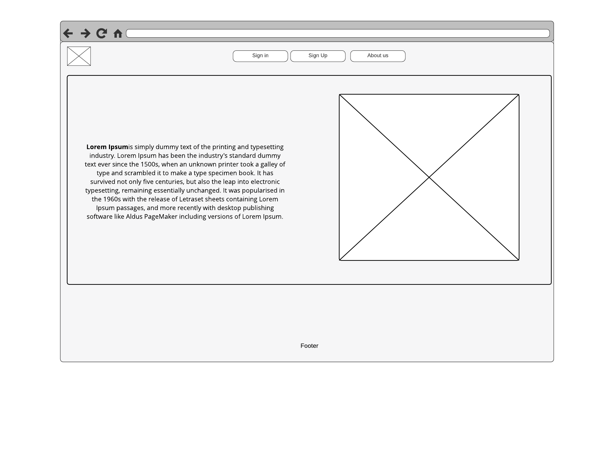
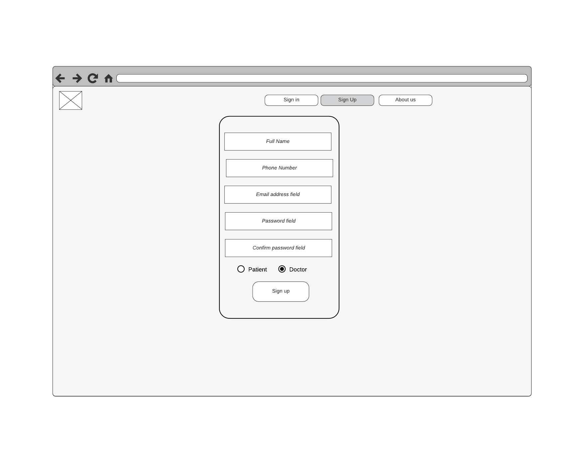
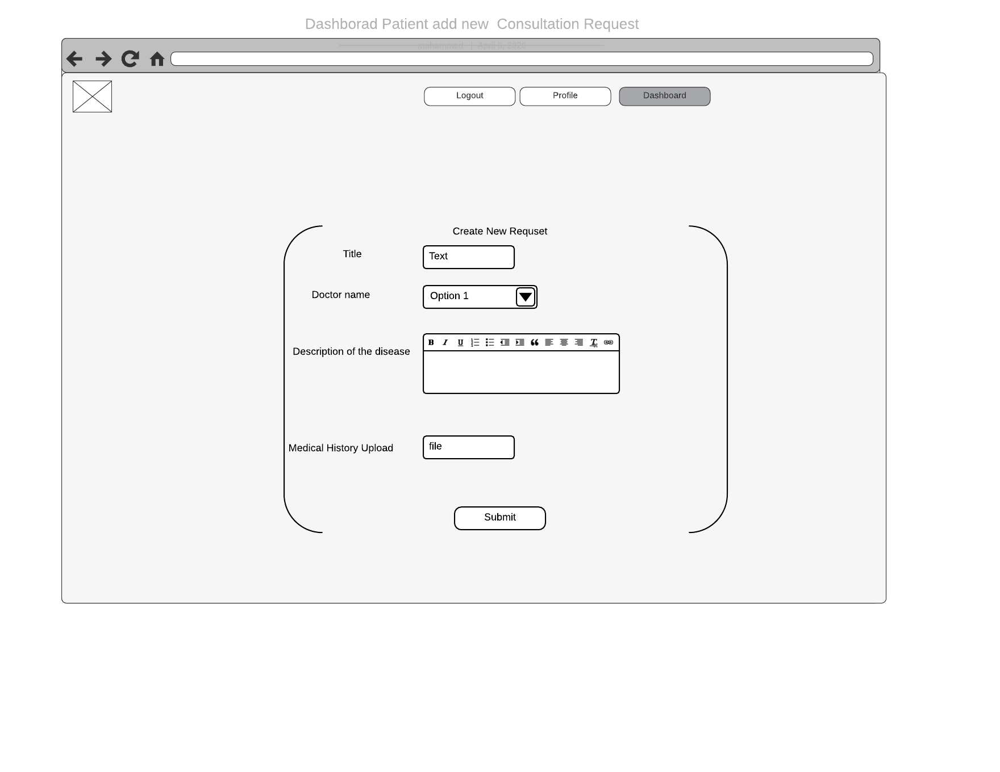
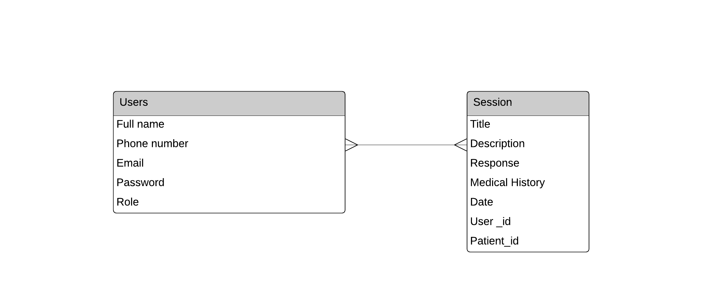

# Medical Consultant Online (Full Stack Application)

## About The Project:
This project is about a new system which is a Consultation Website to help patients and doctors. The patients register with the Website and provide personal information and history of diseases and doctors replies and they get a notification.

### Deployed link:
[Link Demo](http://51.254.123.198:3000/)

## Technology used :
 - Ruby and Rails 
 - PostgreSQL 
 - Bootstrap
 - Jquery
 

## Gems used :
- Devise
- Nexmo
- WYSIWYG

## Wireframe:

## ERD:

## User Stories version 1:
- As a patient, I can create a session
- As a patient, I can remove a session
- As a patient, I can edit a session information
- As a patient, I can list all my sessions information
- As a doctor, I can reply to a session
- As a doctor, I can get all session list 
- As a patient, I can sign up into the dashboard
- As a patient, I can log into the dashboard
- As a doctor, I can sign up into the dashboard
- As a doctor, I can log into the dashboard
## User Stories version 2:
- As a patient, I get an SMS notification when the doctor replies
- As a patient, I can upload my medical report
- As a doctor, I can view patient medical report 
- As a doctor, I can download a patient medical report
## Future plans:
- Add live chat between the patient and doctors.

## Unsolved Problems:
None